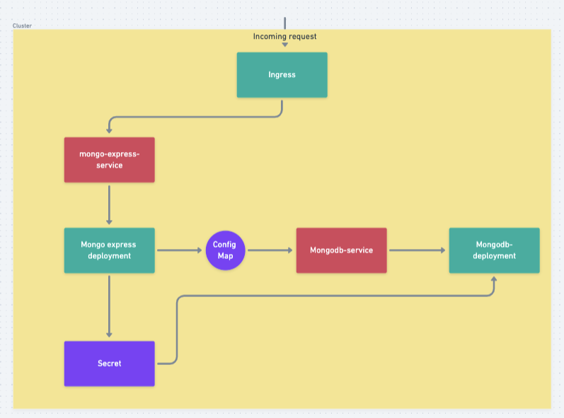

## TalentPlus test helm chart.

This project describe the architecture for a kubernetes cluster featuring a frontend application pod and 2 replicas of a backend database manager system. My choices of software to host in this project, were intended to ensure that the platform can be hosted on any node cluster or system locally or in production.
_This setup was tested on minikube_.

## Structure

The components of this system included the following.

- An ingress component
- 2 services
- 3 pods
  - One frontend pod
  - 2 backend pods.

The images picked for hosting are as follows.

- Mongo-express: For the frontend, I picked [mongo-express](https://hub.docker.com/_/mongo-express), A Web-based MongoDB admin interface, written with Node.js and express. This makes it the perfect frontend interface to connect to a mongodb backend.
- Mongo: For the backend, I picked [mongo](https://hub.docker.com/_/mongo), MongoDB document databases provide high availability and easy scalability, and they are very lightweight. Coupled with the mongo-express frontend, this made it a convnient set to host.

### The Helm Chart

The helm chart was manually defined and create, all folders and assets choosen manually, in a more robust project I'll take an automatic approach, via `helm create` command, but this was favourable to properly defining parameters, attributes and structuring the system how I was it best.

Ideally, I would also define a persisted Volume for the backend deployment to persist it's data, but I didn't feel it was explicitly nessecary for this example project.
If not then I can define a `PersistentVolume` to mount a node folder within the file-system.

The helm templates defined within this project includes the following.

- app-configmap
- app-secret
- backend-deployment
- backend-service
- frontend-deployment
- frontend-service
- ingress

The `values.yml` contains the configurations needed to host and run this project base.
